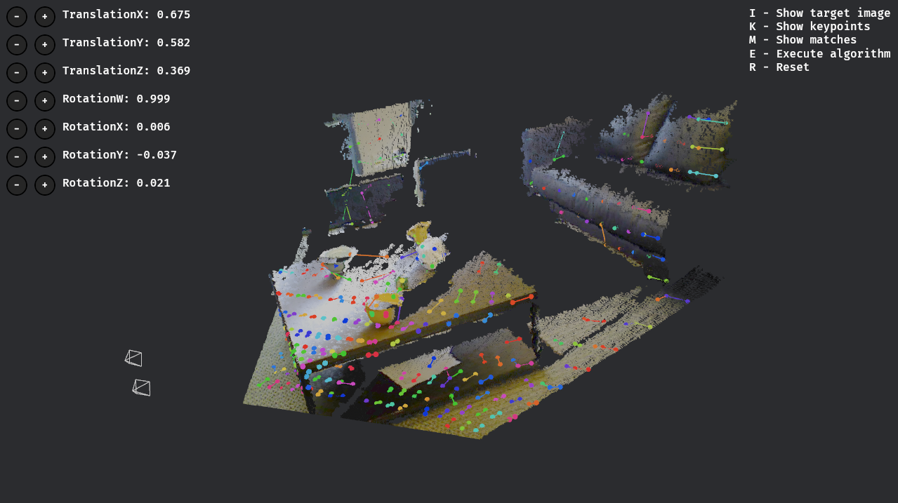

# Evolutionary Image Registration for 3D Modeling

The aim of this project is to align point clouds extracted from RGB-D images, minimizing the error by using evolution strategies (a subgroup of evolutionary algorithms).

## Dataset

The dataset was obtained from the University of Washington, and it is available on https://rgbd-dataset.cs.washington.edu/dataset.html

More details about the chosen scenes: https://rgbd-dataset.cs.washington.edu/dataset/rgbd-scenes-v2/README.txt

## Other common methods to solve this problem

- ICP: https://cs.gmu.edu/~kosecka/cs685/cs685-icp.pdf

## Showcase

The screenshot shows the successful alignment of two point clouds. The colorful dots and lines indicate the correspondences and their distance (error).
